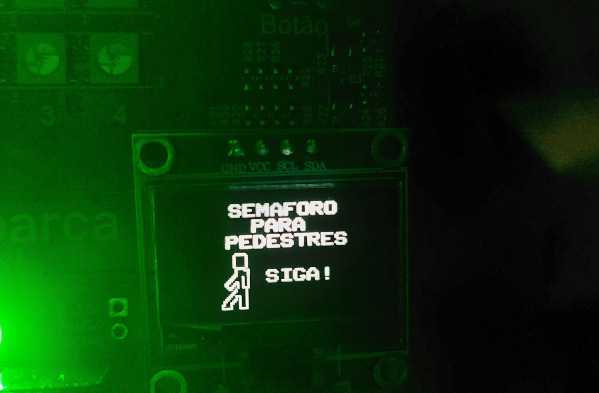
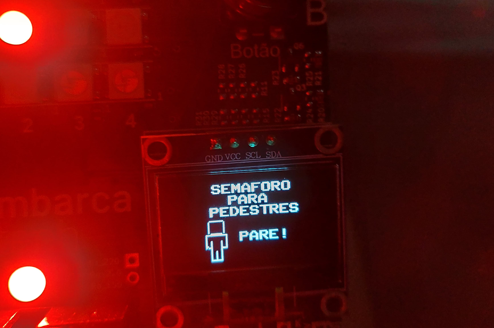

# SemaforoMultitarefa
Repositório destinado ao desenvolvimento da Tarefa da Aula Síncrona do dia 29/05 sobre Sistemas Multitarefa da Residência em Software Embarcado - Embarca Tech TIC 37

__Responsável pelo desenvolvimento:__
Andressa Sousa Fonseca

## Descrição Da Tarefa 
__Utilização de Sistema Multitarefas para desenvolver um Sistema de Semáforo Integrado__   

__Os Componentes necessários para a execução da atividade são:__
1) Matriz 5x5 de LEDs (endereçáveis) WS2812, conectada à GPIO 7;
2) Botão A conectado à GPIO 5;
3) Botão B conectado à GPIO 6;
4) Display SSD1306 conectado via I2C (GPIO 14 e GPIO15);
5) Buzzer conectado à GPIO 21;

__Uma breve explicação do desenvolvimento e resultados obtidos podem ser vistos no vídeo endereçado no seguine link: [Semaforo Multitarefa]().__

## Funcionalidades 

### 1. Sistema com Multitarefa
Os periféricos são definidos e controlados por tasks diferente. Todas as Tarefas criadas possuem a mesma prioridade, sendo a sincronização feita por variáevis globais. O Sistema de Multitarefas permitiu manipular periféricos diferentes de forma ordenada e sincronizada.
### 2. Ciclo de Cores com LEDs RGB e Matriz de Leds
O Sinal Verde fica ligado por 15s. Já o Sinal Amarelo fica ligado por 5s e, por sua vez, o Sinal Vermelho fica ligado por 30s. Ademais, para uma transição suave, há uma pausa de 0,5s entre as mudanças. Os LEDS RGB e a Matriz de Leds são sincronizados.
### 3. Semaforo para pedestres com o Display
O Display tem a função de simular um semaforo para pedestres. Quando os leds estão no Sinal Verde, o display exibe um desenho de uma pessoa parada para sinalizar que ainda não é o momento de atravessar, já durante o Sinal Vermelho, o bonequinha exibido dá um passo, indicando que é seguro atravessar. Ademais, mensagens acompanham as sinalizações. 

  

  

 

### 4. Sinalização sonora para alertar pessoas com deficiências visuais
No Sinal Verde um bip longo de 1s é emitido, depois bips curtos constantes indicam a transição para o Sinal Amarelo. E, por último, um bip de 0,5s com intervalo de 1,5s indica o sinal Vermelho. 
### 5. Dois modos de sinalização com mudança a partir de uma Task
O ciclo verde -> amarelo -> vermelho consiste no modo normal. Ao pressionar o Botão A, a chamada de interrrupção ativa uma Tarefa responsável por modificar a flag do modo.  
O modo noturno exibe apenas o Sinal Amarelo piscando lentamente com um beep a cada 2s. E o Display exibe apenas a mensagem de "CUIDADO!"
